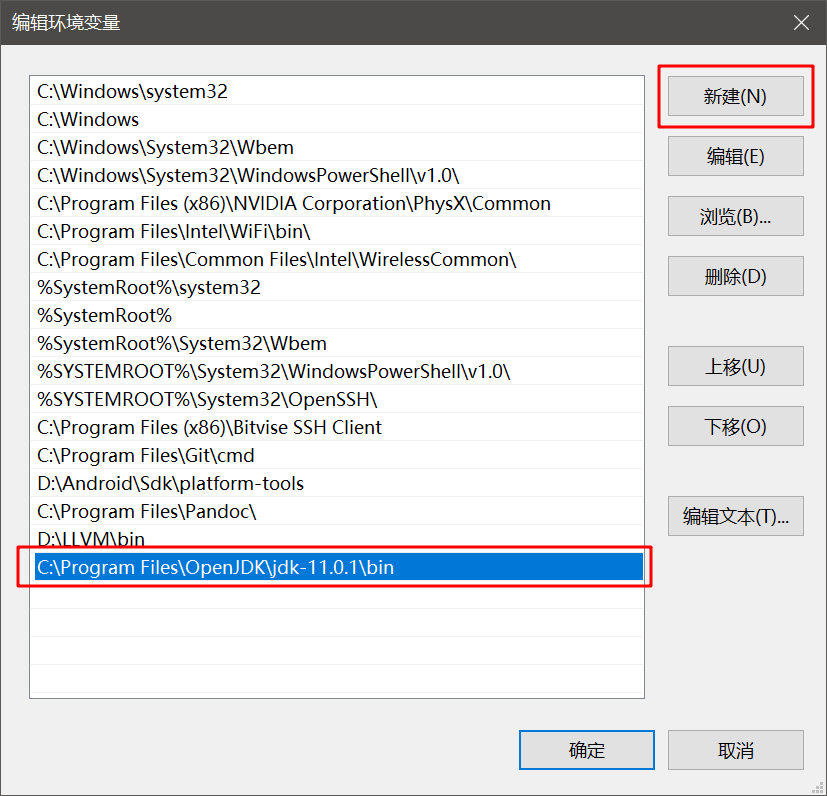
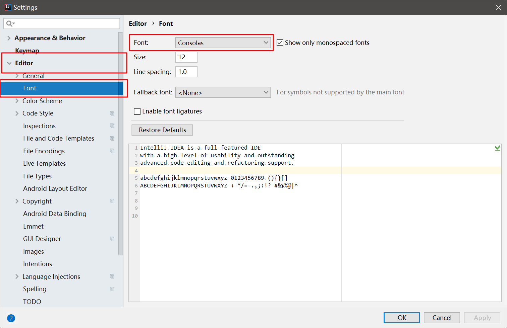

### Java开发环境部署

####  关于
  - 本文将指导安装以下内容
    + **OpenJDK**
    + **IntelliJ IDEA**
  - 本文的演示环境
    + **Windows 10 (1803)**
  - 本文使用的应用
    + **7Zip** (解压缩)

#### 开始之前
  请下载以下文件(**善用搜索引擎**)
  - OpenJDK ([11.0.1](https://download.java.net/java/GA/jdk11/13/GPL/openjdk-11.0.1_windows-x64_bin.zip))
  - IntelliJ IDEA ([Community 2018.2.6](https://download.jetbrains.com/idea/ideaIC-2018.2.6.exe))

#### 配置 OpenJDK
  1. 解压**上节下载的** OpenJDK预编译 **压缩包** 到任意路径(记该路径为**A_PATH**)
      
      

      此处的 **A_PATH** 为 **C:\Program Files\OpenJDK\jdk-11.0.1**

  2. 配置 **OpenJDK** 的 **环境变量**

     + 打开  **高级系统设置**  页面 
     
       - 右键 **此电脑(我的电脑)** - 属性
       
         
       
       - 高级系统设置
       
         
         
       - 环境变量
       
         
       
       - 系统变量 - Path
       
         
       
       - 单击Path - 编辑
       
         
       
       - 新建 - 填入 **A_PATH\bin** (**A_PATH**来源于上文 ,本文此处为 C:\Program Files\OpenJDK\jdk-11.0.1\bin)
       
         
       
       - 确定


3. 确认 **OpenJDK** 已配置完成 **(可选)**

   - 键盘按下组合键 **WIN + R**

   - 填入 cmd
      

   - 确定

   - 输入 
     ```bash
     java --version
     ```
      

      若出现 **OpenJDK** 开头的文本 即为成功 否则请检查 安装过程


#### 安装 IntelliJ IDEA

运行上文下载的IntelliJ IDEA安装程序 (本文为ideaIC-2018.2.6.exe)

1. Next (下一步)
   


2. 更改安装路径 (**可选**)
   


3. 安装选项 (**建议按图中勾选**)
   


4. 开始菜单目录 (建议直接下一步)
   


5. 完成
   


####  配置 IntelliJ IDEA

启动上文安装的 **IntelliJ IDEA**

1. 隐私政策


  拖动滚动条至底部 点击 **Accept**(同意)


2. 导入旧的配置文件 (从未安装过直接下一步)


3. 主题选择

   左边为暗色主题 右边为亮色主题 

   根据个人喜好选择 (本文选择亮色主题)

   


4. 使用默认设置完成初始化

   点击 **Skip Remaining and Set Defaults** (跳过剩余的并设置为默认)

   


5. 完成配置

   


#### 创建一个空项目

启动上文安装的 **IntelliJ IDEA**  

1. 创建新项目
   点击 **Create New Project** (创建新项目)
   

2. 选择JDK

   - 点击 **Project SDK** 右边的 **New..**

     

   - 选择 **安装OpenJDK** 时的 **A_PATH** (本文为 C:\Program Files\OpenJDK\jdk-11.0.1)

     

3.  选择其他依赖

   **直接 Next**

   

4. 从模板创建工程

   

5. 项目名称和路径

   根据需要更改 **名称和路径**

   

   最后点击 **Finish** 

6. 关闭提示 ~~(反正也看不懂)~~

   

7. 创建一个类

   - 在 **项目文件(左边框)** 中找到 **src** 目录

     

   - **右键src** - **New** - **Java Class**

   - Name 填入 **类名** (这里是 Main)

     

   - 确认后即完成类创建

8. 编写 Hello World 测试 (可选)

   - 编写代码

     ```java
     public class Main {
         public static void main(String[] args) {
             System.out.println("Hello World!");
         }
     }
     ```

     

   - 运行

     点击 **可运行类**(此处是Main) 左边的播放键

     

   - 检查结果

     运行结果输出在下方窗口

     


#### 更改字体(可选)

启动上文安装的 **IntelliJ IDEA**

1. File - Settings

   

2. **依次展开** Editor - Font

   修改 Font 即可 (此处为 **Consolas**)

   

3. OK

   完成


